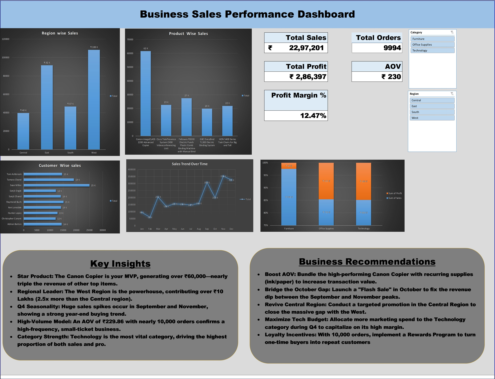

# Business Sales Performance Analysis - Task 1
**Internship:** Future Interns  
**Domain:** Data Analytics  
**Analyst:** Shobhit Trivedi

## 📌 Project Overview
This project involves a comprehensive analysis of the "Superstore" retail dataset to evaluate sales performance across different regions, categories, and timeframes. The goal was to transform raw data into an interactive, decision-support dashboard to help stakeholders identify growth opportunities and efficiency gaps.

## 📊 Dashboard Preview

## 🛠️ Tools & Techniques Used
* **Data Cleaning:** Processed raw data in Excel to handle date formatting, remove duplicates, and ensure data integrity.
* **Data Modeling:** Created helper columns for metrics like "Unique Orders" and used Pivot Tables for multi-dimensional analysis.
* **Visualization:** Designed an interactive dashboard with dynamic Pivot Charts, Slicers, and optimized formatting.
* **Insights Generation:** Conducted Exploratory Data Analysis (EDA) to derive actionable business strategies.

## 📊 Key Performance Indicators (KPIs)
Based on the final analysis of 9,994 orders:
* **Total Sales:** ₹22,97,201
* **Total Profit:** ₹2,86,397
* **Total Orders:** 9,994
* **Profit Margin:** 12.47%
* **Average Order Value (AOV):** ₹230

## 💡 Key Insights
* **Star Product:** The **Canon ImageCLASS Copier** is the top revenue driver, generating over ₹60,000—nearly triple the revenue of other top items.
* **Regional Leader:** The **West Region** is the powerhouse, contributing over ₹10 Lakhs (2.5x more than the Central region).
* **Q4 Seasonality:** Significant sales spikes occur in **September and November**, indicating a strong year-end buying trend.
* **High-Volume Model:** An AOV of ₹230 with nearly 10,000 orders confirms a high-frequency business mode.
* **Category Strength:** The **Technology** category is the most vital, driving the highest proportion of both sales and profit.

## 🚀 Strategic Recommendations
* **Bundle High-Margin Accessories:** Bundle the high-performing Canon Copier with consumables (ink/paper) to increase transaction value.
* **Bridge the October Gap:** Launch a **"Flash Sale" in October** to fix the revenue dip between the September and November peaks.
* **Revive Central Region:** Conduct targeted promotions in the **Central Region** to close the performance gap with the West.
* **Maximize Tech Budget:** Allocate more marketing spend to the **Technology category** during Q4 to capitalize on its high profitability.
* **Loyalty Incentives:** Implement a **Rewards Program** to turn the high volume of one-time buyers into repeat customers.

## 📁 Files Included
* `Shobhit_Trivedi_Task1_ Superstore Analysis.xlsx`: The complete interactive workbook.
* `Shobhit_Trivedi_Task1_ Superstore Dataset.csv`: The raw input data used for analysis.
* `Shobhit_Trivedi_Task1_Dashboard Superstore.pdf`: A professional, single-page PDF export.
* `Shobhit_Trivedi_Task1_Video.mp4`: A video walk-through demonstrating dashboard interactivity and key findings.
* `README.md`: Project documentation and analysis summary.
