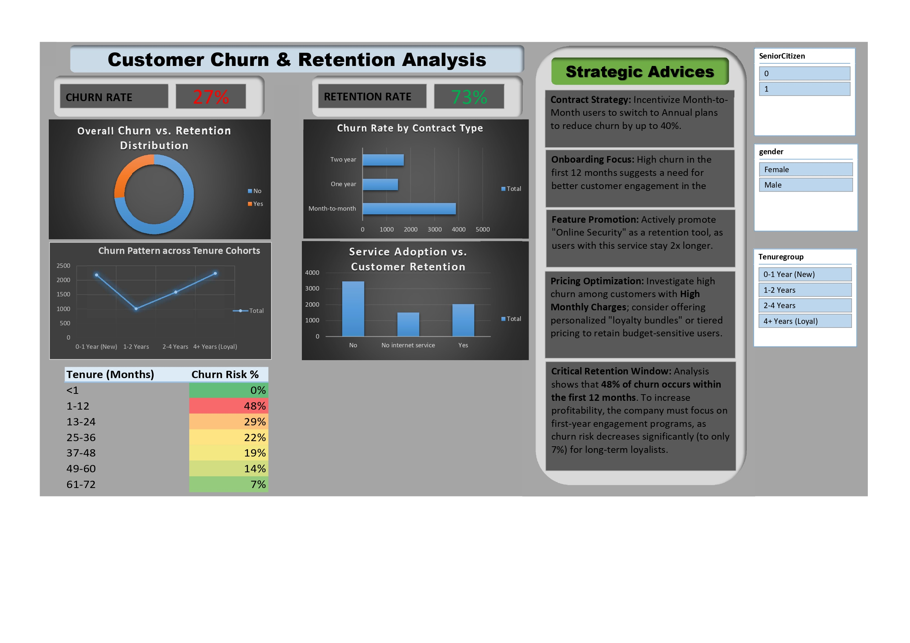

# Customer Retention & Churn Analysis (Task 2) - Future Interns

### 📊 Project Dashboard

### 🎯 Project Objective
This project aims to analyze customer behavior for a subscription-based service to identify key drivers of churn (customer loss) and provide actionable insights for improving retention and increasing Customer Lifetime Value (CLV).

---

### 📂 Repository Contents
* **Analysis_SQL_Queries.sql**: Contains the complete SQL code used for data cleaning, binary conversion, and feature-based analysis.
* **Dashboard_Task2.pdf / .jpg**: Visual representation of the data highlighting key KPIs and trends.
* **Telco-Customer-Churn_Analysis.xlsx**: The processed data model in Excel including Contract Analysis, Service Impact, and Tenure Trends.

---

### 🛠️ Technical Skills Demonstrated
* **SQL (MySQL)**: 
    * Performed data cleaning and handled missing values in `TotalCharges`.
    * Used `CASE` statements for binary conversion of churn status.
    * Developed Cohort grouping logic to analyze customer tenure.
* **Advanced Excel**:
    * Built a professional, interactive dashboard using **Pivot Tables** and **Slicers**.
    * Visualized KPIs through Bar charts, Donut charts, and Trend lines.
    * Managed a SQL-to-Excel data workflow for reporting.

---

### 📊 Key Insights Derived
1. **Overall Churn Rate**: The business has a global churn rate of approximately **26.5%**.
2. **Contract Type Impact**: Customers on **Month-to-month contracts** are the highest risk group, churn rate is significantly higher compared to one or two-year subscribers.
3. **Tenure Patterns**: The highest churn occurs within the **first 12 months** of subscription, indicating a need for better early-stage engagement.
4. **Retention Drivers**: Customers who utilize **Online Security** and **Tech Support** services show a much higher retention rate.
5. **Payment Friction**: Users paying via **Electronic Check** have a higher tendency to churn than those on automated payment methods.

---

### 💡 Strategic Recommendations
* **Incentivize Long-term Contracts**: Offer discounts to month-to-month users who switch to a yearly plan to stabilize revenue.
* **Targeted Onboarding**: Focus customer success efforts on the first 6 months of the customer journey to reduce early-stage churn.
* **Feature Promotion**: Actively promote 'Tech Support' and 'Online Security' as value-added services to high-risk segments.
* **Automate Payments**: Encourage customers to switch from manual checks to 'Credit Card (Automatic)' to reduce involuntary churn.

---

### 📩 Contact & Portfolio
* **Name**: Shobhit Trivedi
* **Role**: Data Analytics Intern (Future Interns)
* **Tools**: SQL | Excel | Data Visualization
